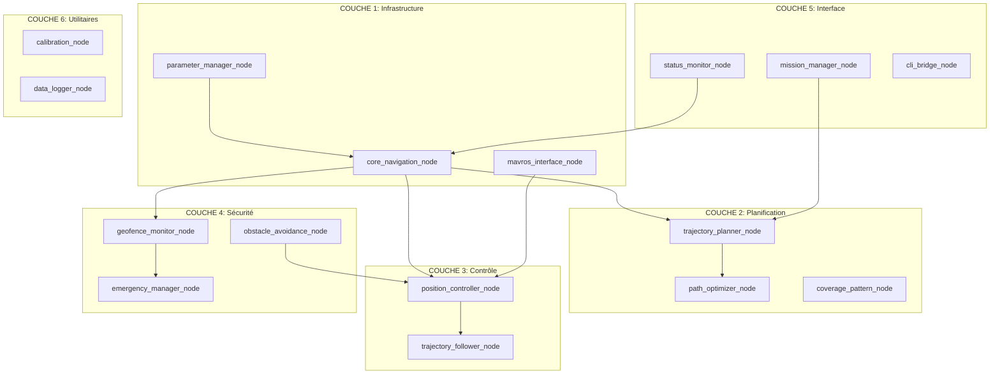

# 🏗️ DRONE NAVIGATION - ARCHITECTURE & ROADMAP

[](https://docs.ros.org/en/humble/)
[](https://www.python.org/)
[](LICENSE)

## 📋 ROADMAP GÉNÉRAL DU PACKAGE

### 🎯 OBJECTIF PRINCIPAL
Développer un système de navigation autonome modulaire pour drones de pollinisation, structuré en micro-nœuds ROS2 indépendants et réutilisables.

### 🚀 PHASES DE DÉVELOPPEMENT

#### **PHASE 1 : Infrastructure de Base (Semaines 1-2)**
- Nœuds de communication et coordination
- Interface MAVROS
- Gestion des paramètres

#### **PHASE 2 : Planification (Semaines 3-4)**
- Algorithmes de planification de trajectoires
- Optimisation des chemins
- Patterns de couverture

#### **PHASE 3 : Contrôle (Semaines 5-6)**
- Contrôleur de position
- Suivi de trajectoire
- Régulation en temps réel

#### **PHASE 4 : Sécurité (Semaines 7-8)**
- Géobarrières et zones de sécurité
- Évitement d'obstacles
- Gestion d'urgence

#### **PHASE 5 : Interface & Intégration (Semaines 9-10)**
- Outils CLI et interface utilisateur
- Surveillance et diagnostics
- Tests d'intégration

#### **PHASE 6 : Validation & Documentation (Semaines 11-12)**
- Tests exhaustifs
- Documentation complète
- Optimisation des performances

## 🏛️ ARCHITECTURE EN MICRO-NŒUDS

### 📊 DIAGRAMME D'ARCHITECTURE



## 📝 ORDRE DE DÉVELOPPEMENT DES NŒUDS

### **ÉTAPE 1 : Fondations (Priorité critique)**
1. `parameter_manager_node` - Gestion centralisée des paramètres
2. `mavros_interface_node` - Communication avec l'autopilot
3. `core_navigation_node` - Orchestrateur principal

### **ÉTAPE 2 : Planification (Priorité haute)**
4. `trajectory_planner_node` - Algorithmes de planification
5. `coverage_pattern_node` - Génération de patterns
6. `path_optimizer_node` - Optimisation des trajectoires

### **ÉTAPE 3 : Contrôle (Priorité haute)**
7. `position_controller_node` - Contrôle PID
8. `trajectory_follower_node` - Suivi de trajectoire

### **ÉTAPE 4 : Sécurité (Priorité critique)**
9. `geofence_monitor_node` - Surveillance des zones
10. `emergency_manager_node` - Gestion d'urgence
11. `obstacle_avoidance_node` - Évitement d'obstacles

### **ÉTAPE 5 : Interface (Priorité moyenne)**
12. `mission_manager_node` - Gestion des missions
13. `status_monitor_node` - Surveillance système
14. `cli_bridge_node` - Interface outils CLI

### **ÉTAPE 6 : Utilitaires (Priorité basse)**
15. `calibration_node` - Calibration automatique
16. `data_logger_node` - Logging et analyse

## 🔗 RÉFÉRENCES OFFICIELLES

### **Documentation ROS2**
- [ROS2 Humble Documentation](https://docs.ros.org/en/humble/)
- [ROS2 Node Lifecycle](https://design.ros2.org/articles/node_lifecycle.html)
- [ROS2 Launch System](https://docs.ros.org/en/humble/Tutorials/Intermediate/Launch/Launch-Main.html)
- [ROS2 Parameters](https://docs.ros.org/en/humble/Concepts/About-ROS-2-Parameters.html)

### **MAVROS & ArduPilot**
- [MAVROS Documentation](http://wiki.ros.org/mavros)
- [ArduPilot SITL](https://ardupilot.org/dev/docs/sitl-simulator-software-in-the-loop.html)
- [MAVLink Protocol](https://mavlink.io/en/)

### **Algorithmes de Navigation**
- [Navigation2 Framework](https://navigation.ros.org/)
- [Path Planning Algorithms](https://en.wikipedia.org/wiki/Motion_planning)
- [PID Control Theory](https://en.wikipedia.org/wiki/PID_controller)

### **Standards et Bonnes Pratiques**
- [ROS2 Design Patterns](https://docs.ros.org/en/humble/Contributing/Developer-Guide.html)
- [Python PEP 8](https://peps.python.org/pep-0008/)
- [ROS REP 103 - Standard Units](https://www.ros.org/reps/rep-0103.html)

## 📋 DÉTAILS DES MICRO-NŒUDS

### **COUCHE 1 : Infrastructure**

#### 1.1 `core_navigation_node`
**Rôle** : Orchestrateur principal du système de navigation
- **Responsabilités** :
  - Coordination des micro-nœuds
  - Gestion du lifecycle global
  - États système (idle, planning, navigating, emergency)
  - Interface de haut niveau

- **Interfaces ROS2** :
  ```
  Services Fournis:
    /drone_nav/start_navigation
    /drone_nav/stop_navigation
    /drone_nav/get_system_status
  
  Topics Publiés:
    /drone_nav/system_state
    /drone_nav/navigation_status
  
  Topics Souscrits:
    /drone_nav/emergency_stop
    /mavros/state
  ```

- **Prérequis** : `parameter_manager_node`, `mavros_interface_node`
- **Tests** : Vérification des états, coordination des nœuds

#### 1.2 `mavros_interface_node`
**Rôle** : Interface exclusive avec MAVROS/ArduPilot
- **Responsabilités** :
  - Communication MAVLink
  - Gestion des modes de vol
  - Publication de la télémétrie
  - Envoi des commandes

- **Interfaces ROS2** :
  ```
  Services Fournis:
    /drone_nav/set_mode
    /drone_nav/arm_disarm
    /drone_nav/takeoff
    /drone_nav/land
  
  Topics Publiés:
    /drone_nav/position
    /drone_nav/velocity
    /drone_nav/attitude
  
  Topics Souscrits:
    /mavros/local_position/pose
    /mavros/state
    /drone_nav/cmd_vel
  ```

- **Prérequis** : MAVROS en fonctionnement
- **Tests** : Simulation SITL, vérification des commandes

#### 1.3 `parameter_manager_node`
**Rôle** : Gestion centralisée des paramètres système
- **Responsabilités** :
  - Chargement des configurations YAML
  - Distribution des paramètres aux nœuds
  - Reconfiguration dynamique
  - Validation des paramètres

- **Interfaces ROS2** :
  ```
  Services Fournis:
    /drone_nav/set_parameter
    /drone_nav/get_parameter
    /drone_nav/reload_config
  
  Topics Publiés:
    /drone_nav/parameter_updates
  ```

- **Prérequis** : Fichiers de configuration YAML
- **Tests** : Validation des paramètres, rechargement

### **COUCHE 2 : Planification**

#### 2.1 `trajectory_planner_node`
**Rôle** : Planification intelligente des trajectoires
- **Responsabilités** :
  - Algorithmes A*, RRT*, Dijkstra
  - Génération de waypoints
  - Prise en compte des obstacles
  - Optimisation multi-critères

- **Interfaces ROS2** :
  ```
  Services Fournis:
    /drone_nav/plan_trajectory
    /drone_nav/replan_trajectory
  
  Topics Publiés:
    /drone_nav/planned_path
    /drone_nav/planning_status
  
  Topics Souscrits:
    /drone_nav/goal_position
    /drone_nav/obstacles
  ```

- **Prérequis** : `core_navigation_node`
- **Tests** : Validation des algorithmes, performance

#### 2.2 `coverage_pattern_node`
**Rôle** : Génération de patterns de couverture
- **Responsabilités** :
  - Patterns zigzag, spiral, adaptatif
  - Optimisation pour pollinisation
  - Prise en compte de la zone
  - Calcul de la couverture

- **Interfaces ROS2** :
  ```
  Services Fournis:
    /drone_nav/generate_pattern
    /drone_nav/optimize_coverage
  
  Topics Publiés:
    /drone_nav/coverage_pattern
    /drone_nav/coverage_metrics
  ```

- **Prérequis** : Zone de mission définie
- **Tests** : Validation des patterns, efficacité

#### 2.3 `path_optimizer_node`
**Rôle** : Optimisation avancée des chemins
- **Responsabilités** :
  - Algorithme génétique TSP
  - Lissage des trajectoires
  - Optimisation multi-objectifs
  - Réduction des waypoints

- **Interfaces ROS2** :
  ```
  Services Fournis:
    /drone_nav/optimize_path
    /drone_nav/smooth_trajectory
  
  Topics Publiés:
    /drone_nav/optimized_path
    /drone_nav/optimization_metrics
  ```

- **Prérequis** : `trajectory_planner_node`
- **Tests** : Métriques d'amélioration, performance

### **COUCHE 3 : Contrôle**

#### 3.1 `position_controller_node`
**Rôle** : Contrôle précis de la position
- **Responsabilités** :
  - Contrôleurs PID multi-axes
  - Anti-windup et saturation
  - Mode précision ±0.5m
  - Génération des commandes

- **Interfaces ROS2** :
  ```
  Services Fournis:
    /drone_nav/set_target_position
    /drone_nav/tune_pid
  
  Topics Publiés:
    /drone_nav/cmd_vel
    /drone_nav/control_error
  
  Topics Souscrits:
    /drone_nav/position
    /drone_nav/target_waypoint
  ```

- **Prérequis** : `mavros_interface_node`
- **Tests** : Réponse en boucle fermée, stabilité

#### 3.2 `trajectory_follower_node`
**Rôle** : Suivi de trajectoire en temps réel
- **Responsabilités** :
  - Suivi de chemin
  - Anticipation des waypoints
  - Adaptation de vitesse
  - Gestion des déviations

- **Interfaces ROS2** :
  ```
  Services Fournis:
    /drone_nav/follow_path
    /drone_nav/pause_following
  
  Topics Publiés:
    /drone_nav/following_status
    /drone_nav/trajectory_error
  
  Topics Souscrits:
    /drone_nav/planned_path
    /drone_nav/position
  ```

- **Prérequis** : `position_controller_node`
- **Tests** : Précision de suivi, adaptation

### **COUCHE 4 : Sécurité**

#### 4.1 `geofence_monitor_node`
**Rôle** : Surveillance des géobarrières
- **Responsabilités** :
  - Zones inclusion/exclusion
  - Détection violations
  - Alertes préventives
  - Actions automatiques

- **Interfaces ROS2** :
  ```
  Services Fournis:
    /drone_nav/set_geofence
    /drone_nav/check_position
  
  Topics Publiés:
    /drone_nav/geofence_status
    /drone_nav/geofence_alerts
  
  Topics Souscrits:
    /drone_nav/position
  ```

- **Prérequis** : Configuration des zones
- **Tests** : Simulation de violations, réactions

#### 4.2 `emergency_manager_node`
**Rôle** : Gestion des situations d'urgence
- **Responsabilités** :
  - Arrêt d'urgence
  - Return-to-home
  - Atterrissage forcé
  - Escalade de sécurité

- **Interfaces ROS2** :
  ```
  Services Fournis:
    /drone_nav/emergency_stop
    /drone_nav/return_home
    /drone_nav/emergency_land
  
  Topics Publiés:
    /drone_nav/emergency_status
  
  Topics Souscrits:
    /drone_nav/geofence_alerts
    /drone_nav/obstacle_alerts
  ```

- **Prérequis** : `mavros_interface_node`
- **Tests** : Scénarios d'urgence, temps de réaction

#### 4.3 `obstacle_avoidance_node`
**Rôle** : Évitement d'obstacles en temps réel
- **Responsabilités** :
  - Détection d'obstacles
  - Champs de potentiel
  - Trajectoires d'évitement
  - Replanification locale

- **Interfaces ROS2** :
  ```
  Services Fournis:
    /drone_nav/enable_avoidance
    /drone_nav/set_safety_distance
  
  Topics Publiés:
    /drone_nav/obstacles
    /drone_nav/avoidance_commands
  
  Topics Souscrits:
    /drone_nav/sensor_data
    /drone_nav/planned_path
  ```

- **Prérequis** : Capteurs de détection
- **Tests** : Obstacles simulés, réactivité

### **COUCHE 5 : Interface**

#### 5.1 `mission_manager_node`
**Rôle** : Gestion des missions complexes
- **Responsabilités** :
  - Chargement des missions
  - Séquencement des tâches
  - Progression de mission
  - Gestion des événements

- **Interfaces ROS2** :
  ```
  Services Fournis:
    /drone_nav/load_mission
    /drone_nav/start_mission
    /drone_nav/pause_mission
  
  Topics Publiés:
    /drone_nav/mission_status
    /drone_nav/mission_progress
  ```

- **Prérequis** : `trajectory_planner_node`, `coverage_pattern_node`
- **Tests** : Missions prédéfinies, robustesse

#### 5.2 `status_monitor_node`
**Rôle** : Surveillance système temps réel
- **Responsabilités** :
  - Collecte des métriques
  - Surveillance santé
  - Diagnostics automatiques
  - Génération de rapports

- **Interfaces ROS2** :
  ```
  Services Fournis:
    /drone_nav/get_diagnostics
    /drone_nav/health_check
  
  Topics Publiés:
    /drone_nav/system_metrics
    /drone_nav/health_status
  ```

- **Prérequis** : Tous les nœuds actifs
- **Tests** : Métriques de performance, détection d'anomalies

#### 5.3 `cli_bridge_node`
**Rôle** : Interface pour outils CLI
- **Responsabilités** :
  - API pour outils externes
  - Conversion de commandes
  - Gestion des sessions
  - Feedback utilisateur

- **Interfaces ROS2** :
  ```
  Services Fournis:
    /drone_nav/cli_command
    /drone_nav/get_cli_status
  
  Topics Publiés:
    /drone_nav/cli_feedback
  ```

- **Prérequis** : `core_navigation_node`
- **Tests** : Commandes CLI, interface

### **COUCHE 6 : Utilitaires**

#### 6.1 `calibration_node`
**Rôle** : Calibration automatique du système
- **Responsabilités** :
  - Calibration des capteurs
  - Réglage automatique PID
  - Validation des paramètres
  - Optimisation performance

- **Interfaces ROS2** :
  ```
  Services Fournis:
    /drone_nav/auto_calibrate
    /drone_nav/calibrate_sensors
    /drone_nav/tune_controllers
  ```

- **Prérequis** : Système opérationnel
- **Tests** : Procédures de calibration, précision

#### 6.2 `data_logger_node`
**Rôle** : Logging et analyse des données
- **Responsabilités** :
  - Enregistrement des vols
  - Analyse des performances
  - Génération de rapports
  - Archivage des données

- **Interfaces ROS2** :
  ```
  Services Fournis:
    /drone_nav/start_logging
    /drone_nav/stop_logging
    /drone_nav/analyze_data
  
  Topics Souscrits:
    /drone_nav/* (tous les topics)
  ```

- **Prérequis** : Espace de stockage
- **Tests** : Intégrité des données, analyse

## 🔄 RELATIONS INTER-NŒUDS

### **Flux de Données Principal**
```
mavros_interface_node → position_controller_node → trajectory_follower_node
                     ↓
mission_manager_node → trajectory_planner_node → path_optimizer_node
                     ↓
coverage_pattern_node → geofence_monitor_node → emergency_manager_node
```

### **Communication Transversale**
- `parameter_manager_node` : Configuration pour tous
- `status_monitor_node` : Surveillance de tous
- `data_logger_node` : Logging de tous
- `core_navigation_node` : Coordination de tous

## 🧪 STRATÉGIE DE TESTS

### **Tests Unitaires par Nœud**
```bash
# Test d'un nœud individuel
ros2 launch drone_navigation test_<node_name>.launch.py

# Exemples
ros2 launch drone_navigation test_position_controller.launch.py
ros2 launch drone_navigation test_trajectory_planner.launch.py
```

### **Tests d'Intégration par Couche**
```bash
# Test couche infrastructure
ros2 launch drone_navigation test_infrastructure.launch.py

# Test couche planification
ros2 launch drone_navigation test_planning.launch.py

# Test couche contrôle
ros2 launch drone_navigation test_control.launch.py

# Test couche sécurité
ros2 launch drone_navigation test_safety.launch.py
```

### **Tests Système Complet**
```bash
# Test système complet
ros2 launch drone_navigation test_full_system.launch.py

# Test avec simulation SITL
ros2 launch drone_navigation test_sitl_integration.launch.py

# Test de stress
ros2 launch drone_navigation test_stress.launch.py
```

## 🚦 COORDINATION SYSTÈME

### **Launch File Principal**
```xml
<!-- navigation_full.launch.py -->
<launch>
  <!-- Couche 1: Infrastructure -->
  <node pkg="drone_navigation" exec="parameter_manager_node"/>
  <node pkg="drone_navigation" exec="mavros_interface_node"/>
  <node pkg="drone_navigation" exec="core_navigation_node"/>
  
  <!-- Couche 2: Planification -->
  <node pkg="drone_navigation" exec="trajectory_planner_node"/>
  <node pkg="drone_navigation" exec="coverage_pattern_node"/>
  <node pkg="drone_navigation" exec="path_optimizer_node"/>
  
  <!-- Couche 3: Contrôle -->
  <node pkg="drone_navigation" exec="position_controller_node"/>
  <node pkg="drone_navigation" exec="trajectory_follower_node"/>
  
  <!-- Couche 4: Sécurité -->
  <node pkg="drone_navigation" exec="geofence_monitor_node"/>
  <node pkg="drone_navigation" exec="emergency_manager_node"/>
  <node pkg="drone_navigation" exec="obstacle_avoidance_node"/>
  
  <!-- Couche 5: Interface -->
  <node pkg="drone_navigation" exec="mission_manager_node"/>
  <node pkg="drone_navigation" exec="status_monitor_node"/>
  <node pkg="drone_navigation" exec="cli_bridge_node"/>
  
  <!-- Couche 6: Utilitaires -->
  <node pkg="drone_navigation" exec="calibration_node"/>
  <node pkg="drone_navigation" exec="data_logger_node"/>
</launch>
```

### **Séquence de Démarrage**
1. **Infrastructure** : Services de base
2. **Planification** : Capacités de calcul
3. **Contrôle** : Boucles de régulation
4. **Sécurité** : Systèmes de protection
5. **Interface** : Services utilisateur
6. **Utilitaires** : Outils de support

### **Gestion des Dépendances**
- Utilisation du système de lifecycle ROS2
- Attente de disponibilité des services
- Vérification de santé continue
- Redémarrage automatique en cas de panne

## 📊 MÉTRIQUES ET MONITORING

### **KPIs Système**
- Temps de démarrage : < 30 secondes
- Latence de planification : < 100ms
- Fréquence de contrôle : 50Hz
- Disponibilité système : > 99%
- Précision navigation : ±0.5m

### **Monitoring Temps Réel**
```bash
# Dashboard principal
ros2 run drone_navigation system_dashboard

# Métriques individuelles
ros2 topic echo /drone_nav/system_metrics

# Diagnostics automatiques
ros2 service call /drone_nav/health_check
```

## 🎯 ROADMAP D'ÉVOLUTION

### **Version 1.0** (Actuelle)
- Architecture micro-nœuds
- Navigation autonome de base
- Sécurité fondamentale

### **Version 1.1** (3 mois)
- Machine learning pour optimisation
- Support multi-drones
- Interface web

### **Version 2.0** (6 mois)
- Navigation 3D avancée
- Capteurs LiDAR/RGB-D
- IA prédictive

### **Version 2.1** (9 mois)
- Coordination d'essaims
- Apprentissage adaptatif
- Cloud computing

Cette architecture modulaire garantit évolutivité, maintenabilité et robustesse du système de navigation autonome.
